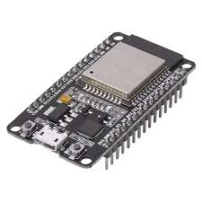

<h2>O que é a Wegnology?</h2>

  

<i><strong>Wegnology</strong> (anteriormente conhecida como <em>Losant</em>) é uma plataforma de <strong>Internet das Coisas (IoT)</strong> baseada na nuvem, projetada para facilitar o desenvolvimento, o gerenciamento e a implementação de soluções IoT escaláveis. Ela é voltada para empresas e desenvolvedores que desejam conectar dispositivos físicos à internet, coletar dados em tempo real e construir aplicações inteligentes.<i></i>

A <strong>Wegnology</strong> é uma <strong>plataforma de IoT low-code</strong> que permite criar soluções complexas sem precisar escrever muito código. Ela oferece uma infraestrutura pronta para conectar dispositivos, processar dados, criar painéis de visualização e automatizar ações com base em eventos.

<h3>Vantagens:</h3>
<ul>
  <li>Plataforma <strong>low-code</strong>, acessível para quem não é especialista em programação.</li>
  <li>Rápida de implementar e escalar.</li>
  <li>Foco na <strong>indústria, agricultura, energia, cidades inteligentes</strong>, etc.</li>
  <li>Oferece <strong>segurança de dados</strong>, <strong>gestão de usuários</strong> e <strong>ambientes de produção/teste</strong>.</li>
</ul>

<h2>Objetivos do Projeto</h2>
<ul>
  <li>Clonar um dispositivo fixo</li>
  <li>Criar dashboard para visualizar dados</li>
  <li>Criar um workflow que lê uma <strong>tag NFC</strong> e envia comando MQTT para <strong>ligar/desligar um LED</strong> em uma ESP32</li>
</ul>

<h2>1. Pré-requisitos</h2>
<ul>
  <li>Conta gratuita na <a href="https://app.wnology.io/" target="_blank">Wegnology (Losant)</a></li>
  <li>ESP32 com suporte a Wi-Fi</li>
  <li>Tag e leitor NFC</li>
  <li>Arduino IDE com bibliotecas:
    <ul>
      <li><code>WiFi.h</code></li>
      <li><code>PubSubClient.h</code></li>
      <li><code>ArduinoJson.h</code></li>
    </ul>
  </li>
  <li>Leitor de tag NFC (opcional)</li>
</ul>

<h2>2. Criando um Dispositivo</h2>
<ol>
  <li>Acesse <a href="https://app.wnology.io">app.wnology.io</a></li>
  <li>Clique em <strong>"Devices" > "+ Add Device"</strong></li>
  <li>Vá na aba <strong>"Access Keys"</strong> e copie:
    <ul>
      <li><code>Access Key</code></li>
      <li><code>Access Secret</code></li>
      <li><code>Device ID</code></li>
    </ul>
  </li>
</ol>

<h2>3. Criando um Dashboard</h2>
<ol>
  <li>Vá em <strong>Dashboards > "+ Add Dashboard"</strong></li>
  <li>Dê um nome (ex: "Controle de LED via NFC")</li>
  <li>Clique em <strong>"+ Add Block"</strong></li>
  <li>Escolha o tipo de gráfico (ex: Gauge, Time Series)</li>
  <li>Conecte com o dispositivo</li>
  <li>Configure o campo de dado (ex: <code>TEMP</code>, <code>umidade</code>)</li>
</ol>

<h2>4. Criando Workflow para NFC</h2>

Este workflow lê uma tag NFC (simulada como <code>TEMP</code>) e envia comando para o LED:

<ol>
  <li>Vá em <strong>"Workflows" > "+ Add Workflow"</strong></li>
  <li>Nome: <code>Ler NFC e Ligar LED</code> | Tipo: <strong>Application Workflow</strong></li>
  <li>Adicione os seguintes blocos:</li>
</ol>

<h3>a) Device: State Trigger</h3>
<ul>
  <li>Escuta os dados enviados (ex: <code>TEMP</code>)</li>
  <li>Configure para escutar o dispositivo clonado</li>
</ul>

<h3>b) Conditional Block</h3>

Verifica o valor lido:

<pre><code>data.TEMP >= 50</code></pre>

Verdadeiro: envia "ligar" Falso: envia "desligar"

<h3>c) Device Command Node</h3>

Payload (verdadeiro):

<pre><code>{
  "state": "on"
}</code></pre>

Payload (falso):

<pre><code>{
  "state": "off"
}</code></pre>

<h2>5. Código Arduino: Envia Temperatura (simula NFC)</h2>
<pre><code>
// == PUBLICADOR - Envia TEMP aleatório (simula NFC) ==
#include &lt;WiFi.h&gt;
#include &lt;ArduinoJson.h&gt;
#include &lt;PubSubClient.h&gt;

const char* WIFI_SSID = "";
const char* WIFI_PASSWORD = "";

const char* MQTT_SERVER = "broker.app.wnology.io";
const int MQTT_PORT = 1883;
const char* MQTT_ACCESS_KEY = "";
const char* MQTT_ACCESS_SECRET = "";
const char* DEVICE_ID = "";
const char* MQTT_TOPIC = "wnology/DEVICE_ID/state"; // Substitua DEVICE_ID

WiFiClient espClient;
PubSubClient client(espClient);

char attributes[200];

void setup() {
  Serial.begin(115200);
  WiFi.begin(WIFI_SSID, WIFI_PASSWORD);
  while (WiFi.status() != WL_CONNECTED) {
    delay(500);
    Serial.println("Conectando ao WiFi...");
  }

  client.setServer(MQTT_SERVER, MQTT_PORT);
  while (!client.connected()) {
    Serial.println("Conectando ao MQTT...");
    client.connect(DEVICE_ID, MQTT_ACCESS_KEY, MQTT_ACCESS_SECRET);
  }
}

void loop() {
  DynamicJsonDocument doc(200);
  doc["data"]["TEMP"] = random(0, 70);

  String payload;
  serializeJson(doc, payload);
  payload.toCharArray(attributes, 200);
  client.publish(MQTT_TOPIC, attributes);

  delay(10000);
}
</code></pre>

<h2>6. Código Arduino: Recebe Comando e Liga LED</h2>
<pre><code>
// == SUBSCRIBER - Recebe comando e liga/desliga LED ==
#include &lt;WiFi.h&gt;
#include &lt;PubSubClient.h&gt;
#include &lt;ArduinoJson.h&gt;

const char* ssid = "";
const char* password = "";

const char* broker = "broker.app.wnology.io";
const int port = 1883;
const char* accessKey = "";
const char* accessSecret = "";
const char* topic = "wnology/DEVICE_ID/command";
const char* clientID = "DEVICE_ID";

WiFiClient wifiClient;
PubSubClient mqttClient(wifiClient);

void setup() {
  Serial.begin(115200);
  pinMode(27, OUTPUT);
  WiFi.begin(ssid, password);
  while (WiFi.status() != WL_CONNECTED) {
    delay(500);
  }

  mqttClient.setServer(broker, port);
  mqttClient.setCallback(callback);
}

void loop() {
  if (!mqttClient.connected()) {
    reconnect();
  }
  mqttClient.loop();
}

void reconnect() {
  while (!mqttClient.connected()) {
    mqttClient.connect(clientID, accessKey, accessSecret);
    mqttClient.subscribe(topic);
  }
}

void callback(char* topic, byte* payload, unsigned int length) {
  DynamicJsonDocument doc(256);
  deserializeJson(doc, payload, length);
  String estado = doc["state"];

  if (estado == "on") {
    digitalWrite(27, HIGH);
    Serial.println("LED LIGADO");
  } else {
    digitalWrite(27, LOW);
    Serial.println("LED DESLIGADO");
  }
}
</code></pre>

<h2>7. <strong>Montagem Física do Projeto com ESP32 + LED + NFC</strong></h2>

  

<h3>Materiais necessários:</h3>

<table>
  <thead>
    <tr>
      <th>Componente</th>
      <th>Quantidade</th>
    </tr>
  </thead>
  <tbody>
    <tr>
      <td>ESP32 Dev Kit (Wi-Fi)</td>
      <td>1</td>
    </tr>
    <tr>
      <td>LED vermelho (ou outro)</td>
      <td>1</td>
    </tr>
    <tr>
      <td>Resistor 220Ω</td>
      <td>1</td>
    </tr>
    <tr>
      <td>Jumpers (macho-macho)</td>
      <td>7</td>
    </tr>
    <tr>
      <td>Protoboard</td>
      <td>1</td>
    </tr>
    <tr>
      <td>Leitor NFC (PN532)</td>
      <td>1</td>
    </tr>
    <tr>
      <td>Tag NFC (cartão ou chaveiro)</td>
      <td>1</td>
    </tr>
  </tbody>
</table>

<h3>Esquema de Montagem do LED:</h3>

<pre>
[ESP32 GPIO 27] ──> (resistor 220Ω) ──> (ânodo do LED)
                                (cátodo do LED) ──> GND
</pre>

<h4>Passos para Montagem:</h4>
<ol>
  <li>Insira a <strong>ESP32</strong> na protoboard, ocupando as trilhas laterais.</li>
  <li>Conecte o <strong>pino GPIO 27</strong> da ESP32 a um <strong>resistor de 220Ω</strong>, que se conecta ao <strong>ânodo</strong> (perna longa) do LED.</li>
  <li>Conecte o <strong>cátodo</strong> (perna curta) do LED ao <strong>GND da ESP32</strong>.</li>
  <li>Conecte o <strong>PN532 NFC</strong> usando os fios jumper conforme descrito na seção anterior.</li>
  <li>Certifique-se de que o PN532 está no modo I2C (normalmente via um jumper ou chave física no módulo).</li>
</ol>

<h3>Como funciona:</h3>
<ul>
  <li>A <strong>ESP32</strong> se conecta à internet via Wi-Fi e ao broker MQTT da Wegnology.</li>
  <li>O <strong>PN532</strong> lê uma tag NFC real e envia a leitura como dado (TEMP ou similar).</li>
  <li>O <strong>Workflow da Wegnology</strong> processa essa leitura e decide enviar um comando MQTT.</li>
  <li>Ao receber o comando <code>{ "state": "on" }</code>, o LED no pino 27 é ligado.</li>
  <li>Ao receber <code>{ "state": "off" }</code>, o LED é desligado.</li>
</ul>

